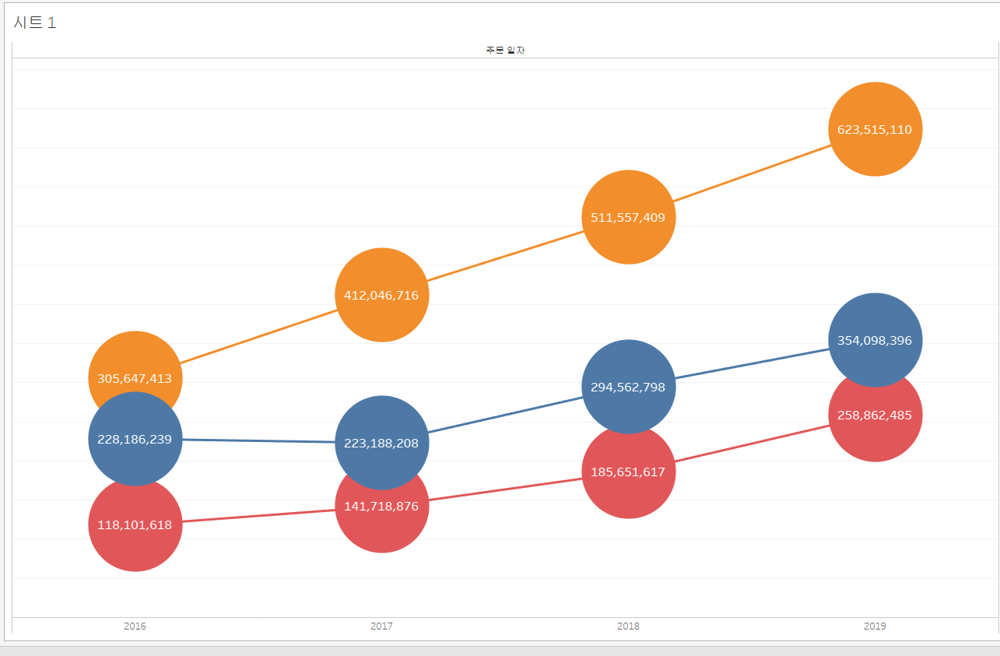

# 1. 고객별 재구매 시기 데이터 분석 테블로 시각화

이 그래프는 고객별 두 번째 구매까지 걸린 날짜(구간 단위)와 고객들의 교차 카운트를 나타냅니다. 각 막대는 특정 구간에 해당하는 고객 수를 보여주며, 높이가 높을수록 그 구간에 해당하는 고객의 재구매 비율이 높은 것을 의미합니다. 

예를 들어, 그래프에서 100일 구간에 해당하는 막대는 고객들이 두 번째 구매까지 걸린 평균 기간이 100일임을 나타내며, 교차 카운트는 25명입니다.

# 2. 고객세그먼트별 매출액 추이 그래프

이 그래프는 고객 세그먼트별 매출액 추이를 나타냅니다. 각 색상은 특정 고객 세그먼트를 나타내며, 각 연도의 매출액이 표시되어 있습니다. 원의 크기가 클수록 매출액이 높음을 의미합니다.

예를 들어, 2016년에는 주황색 세그먼트가 305,647,413원의 매출을 기록하였고, 파란색 세그먼트는 228,186,239원, 빨간색 세그먼트는 118,101,618원의 매출을 기록했습니다.
2019년에는 주황색 세그먼트의 매출액이 623,515,110원으로 증가했고, 파란색 세그먼트는 354,098,396원, 빨간색 세그먼트는 258,862,485원의 매출을 기록했습니다.

# 3. 고객세그먼트별 매출액 누적 막대 그래프

이 그래프는 고객 세그먼트별 매출액 누적 막대를 보여줍니다. 각 연도의 총 매출액을 세그먼트별로 색상을 구분하여 누적한 형식으로, 특정 연도의 전체 매출액 규모와 세그먼트별 기여도를 한눈에 파악할 수 있습니다.

예를 들어, 2016년의 총 매출액은 651,935,270원이며, 주황색 세그먼트가 305,647,413원, 파란색 세그먼트가 228,186,239원, 빨간색 세그먼트가 118,101,618원을 차지합니다.
2019년에는 총 매출액이 1,236,475,991원으로 증가했고, 주황색 세그먼트는 623,515,110원, 파란색 세그먼트는 354,098,396원, 빨간색 세그먼트는 258,862,485원의 기여도를 보였습니다.

# 4. 년도별 매출액 영역차트

이 그래프는 연도별 매출액을 분기 단위로 보여주는 영역 차트입니다. 각 분기의 매출액을 영역으로 표시하여 시계열에 따른 매출 증가와 감소 추이를 시각화합니다.

예를 들어, 2016년 1분기에는 매출액이 94,299,289원으로 시작하여, 2분기에는 142,779,016원, 4분기에는 156,386,040원으로 증가했습니다.
2019년 4분기에는 매출액이 427,666,490원으로 최고치를 기록하며, 전체 매출이 크게 상승했습니다.

# 5. 월별 매출액 라인 그래프 년도 비교 

이 그래프는 월별 매출액을 연도별로 비교한 라인 그래프입니다. 두 개의 라인이 서로 다른 연도를 나타내며, 월별 매출액의 증감 추이를 연도별로 비교할 수 있습니다.

예를 들어, 첫 번째 월에는 파란색 라인이 78,685,345원의 매출을 기록한 반면, 주황색 라인은 68,070,803원을 기록했습니다.
최고 매출을 기록한 달은 파란색 라인에서 137,350,531원, 주황색 라인에서 158,914,030원이었습니다.
마지막 달에는 파란색 라인이 99,326,426원, 주황색 라인이 123,693,563원의 매출을 기록했습니다.

# 6. 라운드형 막대 그래프를  다음과 같이 지역별 매출액 합계

이 그래프는 지역별 매출액 합계를 라운드형 막대 그래프로 나타낸 것입니다. 막대의 크기가 각 지역의 매출액을 시각적으로 보여주며, 매출이 높을수록 막대의 크기가 커집니다.

예를 들어, 수도권은 1,728,958,636원으로 가장 높은 매출액을 기록했습니다. 영남 지역은 899,126,312원으로 두 번째로 높은 매출을 보였습니다.
반면, 강원 지역은 144,718,150원으로 가장 낮은 매출액을 기록했습니다.

# 7. 평균라인이 있는 막대 그래프

# 

이 그래프는 두 가지 유형의 매출을 분기별로 비교하며, 각 유형의 평균 매출을 나타내는 선이 포함되어 있습니다. 파란색과 주황색 막대가 각각 다른 유형의 매출을 나타내며, 평균선이 각 유형의 평균 매출액을 시각적으로 표시하여 매출의 상하 변동을 쉽게 파악할 수 있게 합니다.

예를 들어, 2017년 1분기에서 주황색 유형은 평균보다 높은 매출을 기록했으며, 반면 파란색 유형은 평균보다 낮았습니다.
2019년 4분기에는 주황색과 파란색 유형 모두 평균을 초과하는 높은 매출을 기록했습니다.

# 8. 제품 계층 그래프

이 그래프는 지역별로 매출 규모를 나타낸 막대 그래프로, 지역별로 매출액의 크기를 시각화했습니다. 상위 지역일수록 더 긴 막대를 가지며 매출 규모가 큼을 의미합니다.

예를 들어, 경기도가 가장 높은 매출을 기록했고, 서울의 특정 구가 그 뒤를 잇고 있습니다.
매출이 적은 지역일수록 막대의 길이가 짧습니다.

# 9.지도 그래프

이 지도 그래프는 지리적 위치에 따른 매출 분포를 나타내며, 각 지역의 매출을 점으로 표시하여 매출 규모와 밀집도를 확인할 수 있습니다. 점의 크기가 클수록 해당 지역의 매출이 큼을 나타냅니다.

예를 들어, 수도권과 영남권에 상대적으로 큰 점이 많아 높은 매출을 기록한 지역임을 보여줍니다.
강원도 및 일부 남부 지역은 점이 작고 분포가 상대적으로 드물어 낮은 매출을 기록했음을 나타냅니다.

# 10.서울시 생활권 지도 그래프 (색상 추가)

# 11. 수익 수량 비눗방울 그래프 (기호맵 1)

# 12. 막대 라인 그래프

# 13. 지도 파이 그래프

# 14. 수도권 영역 그래프

